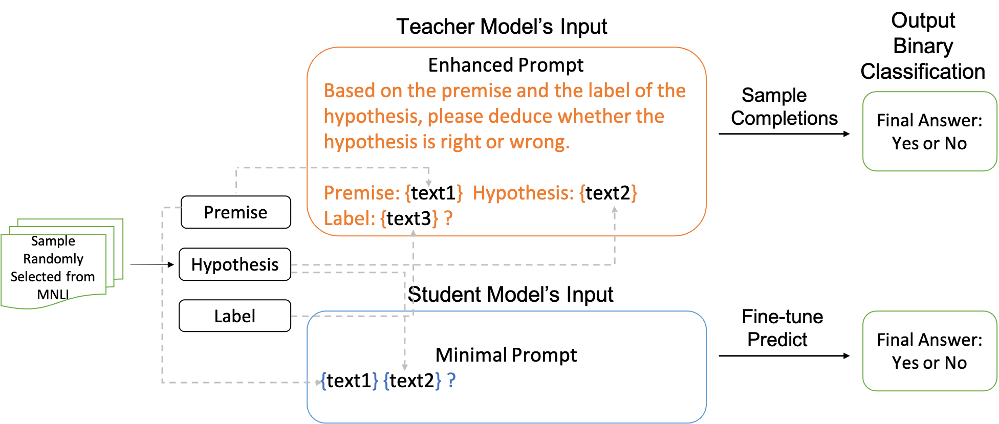
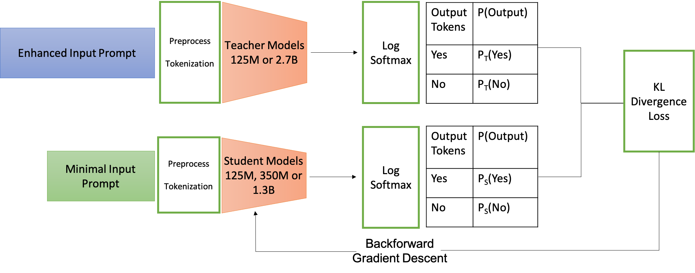

# ContextDistillation-InContextLearning-FineTuning-on-LLMs

## Background

This project aims to tackle the challenge of in-context learning (ICL) within Large Language Models (LLMs). [1,2] These models traditionally demand significant memory due to long context handling. While existing solutions advocate for training models from scratch with extended context length, this project proposes exploring alternative fine-tuning methods to alleviate the context length constraint without necessitating expensive re-training or large dataset fine-tuning. 

The initiative particularly focused on employing the "Context Distillation" method for fine-tuning in the NLI classification task, contrasting it against ICL approach as outlined in previous works. [3] This enhanced LLM performances in handling long dialogue conversations, answering queries on large documents, or aiding in code auto-completion with extensive repository knowledge, without the encumbrance of substantial memory requirements. 

## Approach

We devised two distinct methodologies to optimize LLMs with varying parameter sizes: ICL and CD. Our primary aim was to assess the extent to which ICL can perform without updating weights, exploring the LLMs' potential using various prompt patterns. Secondly, we aim to evaluate CD performance through fine-tuning LLMs, while also confronting the challenges of fine-tuning and the associated computational costs. Moreover, we seek to provide a comparative analysis of these methodologies both quantitatively and qualitatively, offering insights for future applications of LLMs in solving real-world problems. Our project builds upon the repository found at [llmft](https://github.com/uds-lsv/llmft). We adapted its code to meet our unique requirements and ensure smooth integration with our datasets and computational framework.

### In-Context Learning (ICL)
ICL is a well-known strategy that does not update the weights of the LLM. It works by first supplying LLMs with sufficient prompt-based hints, thereby expecting the models to generate the anticipated outputs. In ICL, LLMs are typically provided with demonstrations, which serve as hints for a question, followed by the question itself. It is postulated that LLMs, having been trained on massive datasets, have the inherent knowledge for a myriad of abstract subtasks. This knowledge enables them to answer incoming questions correctly, so long as they are guided in the right direction with suitable hints.

| Dataset | Pattern | Input Text | Output tokens |
|---------|---------|------------|---------------|
| MNLI    | mnimal  | {premise} {hypothesis}? | Yes, No |
| MNLI    | gpt-3   | {premise} question: {hypothesis} Yes or NO? answer: | Yes, No |
| MNLI    | eval-harness | {premise}\n Question: {hypothesis} True or False? \nAnswer: | True, False |
| MNLI    | teacher model in CD | Based on the premise and the label of the hypothesis, please deduce whether the hypothesis is right or wrong. Premise: {text1}  Hypothesis: {text2} Label: {text3} ? | Yes, No |

Table 1. Patterns used for ICL and CD’s teacher model

### Context Distillation (CD)

Figure 1: An overview of context distillation framework.

We utilized CD as a novel approach to fine-tune LLMs, as opposed to the few-shot fine-tuning methods. The architecture of CD is shown in Fig.1  and Fig.2. The main idea is to use a larger teacher model to generate more accurate predictions based on the provided context and then use these predictions to fine tune a smaller student model to improve its accuracy. CD involves bifurcating the prompt into two segments. The first segment, $C$, comprises demonstrations that guide the LLM towards the correct answer. The second segment, $X$, contains a specific question which the LLM is expected to answer. Initially, the entire prompt is processed by a larger, teacher LLM, which computes the log probabilities, $p(X|C)$, indicative of the desired outcomes. Subsequently, the LLM processes only the $X$ segment, generating log probabilities, $p(X)$. The student LLM then utilizes gradient descent to fine-tune, employing a loss function derived from the Kullback–Leibler (KL) divergence between $p(X|C)$ and $p(X)$ \cite{enwiki:1188277594}. The fine-tuning objective is to minimize this loss, enabling the student model to emulate the teacher model's performance, learning from the probabilities inherent to its architecture rather than direct human annotations.

Figure 2: Architecture of context distillation.

### KL Divergence as Loss Function

Our context distillation approach employs the Kullback–Leibler (KL) divergence as a loss measure, quantifying the discrepancy between two probability distributions, $Q$ and $P$. The KL divergence is inherently non-negative, asymmetric, and only reaches zero when the two distributions are identical. It is akin to cross-entropy, a metric commonly used in machine learning to compare probability distributions.

$$D_{KL}(P\|Q) = \sum_{i=1}^{n} p_i \log \frac{p_i}{q_i}$$

$$H(P, Q) = \sum_{i=1}^{n} p_i \log q_i$$

Our implementation involves appending a distilled context, $C$, to the prompts, $X$, and precomputing the logits of target tokens through a forward pass by a more extensive teacher model. These logits are then used to inform the student model through minimization of the KL-divergence loss, thereby fine-tuning the student model to closely mimic the teacher model's token distribution. We limit our storage to 2-token logits for the MNLI dataset's binary class target labels, differing from the approach using the 50 largest logit tokens as proposed in previous research. We hypothesize that a 2-token logits strategy should yield higher accuracy, as it directly minimizes KL-divergence relative to the distribution of binary label tokens. One thing to note is because we are limiting the number of target classes to 2 this approach should be applicable to other datasets with binary classification labels as well. However, in order for it to be applied to word generation, or translation tasks, the number of target classes will need to be extended.

## Experiments and Codes

Experimental details, results and codes are in [this private repositary](https://github.com/EMC2016/LLM_codes.git). 
Please reach me emccs99@gmail.com for codes and more.

 
## Reference

[1]: “Few-shot Fine-tuning vs. In-context Learning: A Fair Comparison and Evaluation”, M.Mosbach et al. https://aclanthology.org/2023.findings-acl.779.pdf

[2] “Few-Shot Parameter-Efficient Fine-Tuning is Better and Cheaper than In-Context Learning”, Haokun Liu et.https://arxiv.org/abs/2205.05638.pdf

[3] “A General Language Assistant as a Laboratory for Alignment”, Askell et al. https://arxiv.org/pdf/2112.00861.pdf

[4] Tom Brown, Benjamin Mann, Nick Ryder, Melanie Subbiah, Jared D Kaplan, Prafulla Dhariwal, Arvind Neelakantan, Pranav Shyam, Girish Sastry, Amanda Askell, et al. Language models are few-shot learners. Advances in neural information processing systems, 33:1877–1901, 2020

[5] “Pretraining task diversity and the emergence of non-Bayesian in-context learning for regression”, Raventós et al. https://arxiv.org/abs/2306.15063

[6] “Learning by distilling context”, Charlie Snell et. al. Charlie Snell, https://arxiv.org/pdf/2209.15189.pdf

[7] https://en.wikipedia.org/wiki/Kullback%E2%80%93Leibler_divergence

[8] https://github.com/uds-lsv/llmft
